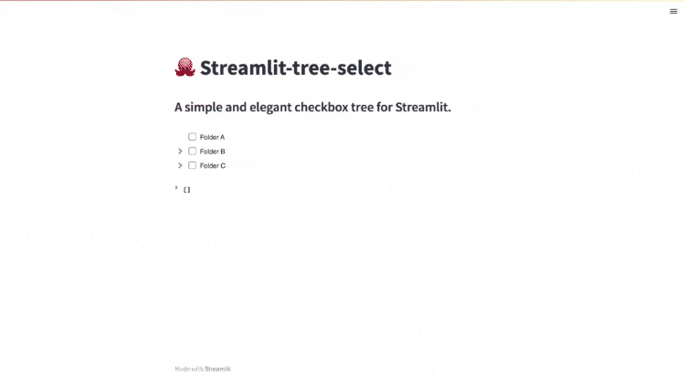

# 🐙 streamlit_tree_select
A simple and elegant checkbox tree for Streamlit. Build on [react-checkbox-tree](https://github.com/jakezatecky/react-checkbox-tree).

<p align="center">
  
</p>

### Installation

streamlit-tree-select is distributed via. [PyPi](https://pypi.org/project/streamlit-tree-select/):

```
pip install streamlit-tree-select
```


### Quickstart
Using streamlit-tree-select is as simple as importing tree_select and passing a list of nodes.
``` python
import streamlit as st
from streamlit_tree_select import tree_select

st.title("🐙 Streamlit-tree-select")
st.subheader("A simple and elegant checkbox tree for Streamlit.")

# Create nodes to display
nodes = [
    {"label": "Folder A", "value": "folder_a"},
    {
        "label": "Folder B",
        "value": "folder_b",
        "children": [
            {"label": "Sub-folder A", "value": "sub_a"},
            {"label": "Sub-folder B", "value": "sub_b"},
            {"label": "Sub-folder C", "value": "sub_c"},
        ],
    },
    {
        "label": "Folder C",
        "value": "folder_c",
        "children": [
            {"label": "Sub-folder D", "value": "sub_d"},
            {
                "label": "Sub-folder E",
                "value": "sub_e",
                "children": [
                    {"label": "Sub-sub-folder A", "value": "sub_sub_a"},
                    {"label": "Sub-sub-folder B", "value": "sub_sub_b"},
                ],
            },
            {"label": "Sub-folder F", "value": "sub_f"},
        ],
    },
]

return_select = tree_select(nodes)
st.write(return_select)

```
### Properties
The tree select can be customized using the following parameters:

| Property             | Type     | Description                                                                                                            | Default     |
| -------------------- | -------- | ---------------------------------------------------------------------------------------------------------------------- | ----------- |
| `nodes`              | list    | A list containing tree nodes and their children. A need needs to include a label and a value. Furthermore, a list of children can be added. Further possible parameters: `className` (A class Name to add to the node, default None), `disabled` (Whether the node should be disabled, default False), `showCheckbox` (Whether the node should show a checkbox, default True), `title` (A custom title attribute for th node, default None).                                                            | `[]`            |
| `check_model`         | str   | Specifies which selected nodes should be returned. Possible inputs: "all", "leaf".                    | `'all'`    |
| `checked`            | list    | A list of selected nodes.                                                                                       | `[]`        |
| `direction`          | str   | Specify the direction of the component. Left-to-right ('ltr') or right-to-left ('rtl').    | `'ltr'`     |
| `disabled`           | bool     | If True, the component will be disabled and cannot be used.                                                   | `False`     |
| `expand_disabled`     | bool     | If True, nodes cannot be expanded.                                                                 | `False`     |
| `expand_on_click`      | bool     | If True, nodes will be expanded by clicking on the labels.                        | `False`     |
| `expanded`           | list    | A list of expanded node values.                                                                                      | `[]`        |
| `no_cascade`          | bool     | If True, toggling a parent node will not cascade its check state to its children.                                  | `False`     |
| `only_leaf_checkboxes` | bool     | If True, checkboxes will only be shown for leaf nodes.                                                                 | `False`     |
| `show_expand_all`      | bool     | If True buttons for expanding and collapsing all parent nodes will appear in the tree.                                | `False`     |

### Returns
tree_select returns a dictionary containing the keys checked node values as well as expanded node values.

| Property             | Type     | Description                                                                                                            | Default     |
| -------------------- | -------- | ---------------------------------------------------------------------------------------------------------------------- | ----------- |
| `checked`           | list    | A list of expanded node values.                                                                                      | `[]`        |`
| `expanded`           | list    | A list of expanded node values.                                                                                      | `[]`        |
